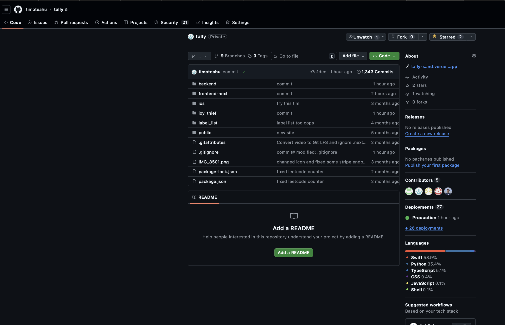

# Tally Clone

This is a clone of the original Tally project, created to protect sensitive keys and credentials (such as Stripe keys, API keys, etc.) that were used in the original implementation.

## Purpose

This repository serves as a sanitized version of the original Tally application, with all sensitive configuration data, API keys, and credentials removed to ensure security while preserving the codebase structure and functionality for development and reference purposes.

## Original Project

The original Tally project can be referenced through the image below:

## Security Notice

⚠️ **Important**: This clone does not contain any production keys, credentials, or sensitive data. All sensitive information has been removed or replaced with placeholder values for security purposes.

## Getting Started

To use this clone, you'll need to:
1. Set up your own API keys and credentials
2. Configure environment variables
3. Update configuration files with your own values

## Project Structure

- `backend/` - Python FastAPI backend
- `frontend-next/` - Next.js frontend application  
- `ios/` - iOS Swift application
- `joy_thief/` - Additional iOS components